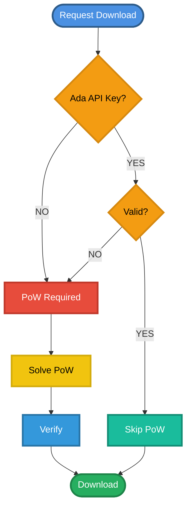

# YouTube Downloader Server

[](https://github.com/siputzx/youtubedl)
[](https://github.com/siputzx/youtubedl/blob/main/.github/workflows/main.yml)
[](https://github.com/siputzx/youtubedl/blob/main/LICENSE)
[](https://github.com/siputzx/youtubedl/releases)

Modular, high-performance YouTube downloader dengan Proof of Work authentication. Dibangun dengan Rust untuk performa maksimal dan keamanan tinggi.

## 🌟 Kelebihan

### ⚡ Performa Tinggi
- **Multi-threading**: Download concurrent dengan kontrol otomatis berdasarkan CPU cores
- **Memory efficient**: Menggunakan Rust dengan zero-cost abstractions
- **Async I/O**: Non-blocking operations untuk handling request maksimal
- **Smart caching**: File caching otomatis dengan cleanup scheduler

### 🔒 Keamanan
- **Proof of Work (PoW)**: Anti-spam protection dengan SHA256 challenge
- **API Key Support**: Premium access dengan custom authentication
- **Path traversal protection**: Security validation untuk file serving
- **Session management**: Secure cookie-based authentication
- **No default credentials**: Zero hardcoded secrets

### 🎯 Fitur Lengkap
- **Multiple formats**: Audio (MP3), Video (MP4), Merge (Video+Audio)
- **Quality selection**: Hierarki format dari 360p hingga 4K
- **YouTube cookies**: Support untuk video yang memerlukan login
- **Metadata embedding**: Auto embed thumbnail dan metadata ke MP3
- **Progress tracking**: Real-time download progress monitoring
- **Smart retry**: Automatic fallback ke format alternatif

### 🐳 Container-Ready
- **Alpine-based**: Image kecil (~200MB) dengan semua dependencies
- **Health checks**: Auto-monitoring container health
- **Volume support**: Persistent storage untuk downloads dan cookies
- **Environment-based**: Full configuration via environment variables
- **Production-ready**: Optimized build dengan UV package manager

### 👨‍💻 Developer-Friendly
- **Modular architecture**: Clean separation of concerns
- **Type-safe**: Rust's compile-time guarantees
- **Minimalist logging**: Request logging dengan latency tracking
- **RESTful API**: Simple HTTP endpoints
- **Well-documented**: Clear code structure

# 🔐 Authentication Flow

## Diagram Alur Autentikasi



## Penjelasan Alur

1. **Request Download**: Pengguna meminta untuk mengunduh file
2. **Cek API Key**: Sistem memeriksa apakah ada API key
   - **Jika ADA**: Lanjut ke validasi API key
   - **Jika TIDAK ADA**: Wajib menyelesaikan Proof of Work (PoW)
3. **Validasi API Key**:
   - **Jika VALID**: Lewati proses PoW
   - **Jika TIDAK VALID**: Wajib menyelesaikan PoW
4. **Proof of Work**: Proses komputasi untuk membuktikan legitimasi
5. **Verify**: Verifikasi hasil PoW
6. **Download**: Akses download diberikan

## Keuntungan Sistem Ini

- ✅ Mencegah spam dan abuse
- ✅ Memberikan prioritas untuk pengguna dengan API key valid
- ✅ Mengurangi beban server dengan PoW untuk pengguna anonim
- ✅ Sistem keamanan berlapis

## 📋 Authentication Modes

### Mode 1: Public PoW (Default)
**Semua orang HARUS solve Proof of Work**

```bash
docker run -d -p 3000:3000 ghcr.io/siputzx/youtubedl:latest
```

- ✅ Anti-spam protection untuk semua user
- ✅ Tidak ada bypass sama sekali
- ✅ Fair usage untuk public deployment

### Mode 2: Hybrid (PoW + API Keys)
**User premium bypass PoW, user biasa tetap PoW**

```bash
docker run -d -p 3000:3000 \
  -e VALID_APIKEYS=secret-key-1,secret-key-2 \
  ghcr.io/siputzx/youtubedl:latest
```

- ✅ Premium users: Direct access dengan API key
- ✅ Regular users: Harus solve PoW
- ✅ Monetization-friendly

## 🚀 Quick Start

### Docker

```bash
docker pull ghcr.io/siputzx/youtubedl:latest

docker run -d \
  --name youtube-downloader \
  -p 3000:3000 \
  -e POW_DIFFICULTY=2 \
  -e MAX_VIDEO_DURATION=10800 \
  -v ./downloads:/app/downloads \
  -v ./cookies:/app/cookies \
  ghcr.io/siputzx/youtubedl:latest
```

### Podman

```bash
podman pull ghcr.io/siputzx/youtubedl:latest

podman run -d \
  --name youtube-downloader \
  -p 3000:3000 \
  -e USE_COOKIES=true \
  -e CACHE_DURATION=18000000 \
  -v ./downloads:/app/downloads:Z \
  -v ./cookies:/app/cookies:Z \
  ghcr.io/siputzx/youtubedl:latest
```

> **Note**: Podman menggunakan `:Z` flag untuk SELinux labeling.

## ⚙️ Environment Variables

### Server Configuration

| Variable | Default | Description |
|----------|---------|-------------|
| `PORT` | `3000` | Port server HTTP |
| `MAX_CONCURRENT` | `auto` | Max concurrent downloads (auto: CPU × 2) |

### Storage Paths

| Variable | Default | Description |
|----------|---------|-------------|
| `DOWNLOADS_DIR` | `/app/downloads` | Root directory untuk downloads |
| `AUDIO_DIR` | `/app/downloads/audio` | Directory untuk file audio |
| `VIDEO_DIR` | `/app/downloads/video` | Directory untuk file video |
| `MERGE_DIR` | `/app/downloads/merge` | Directory untuk file merged |
| `COOKIES_DIR` | `/app/cookies` | Directory untuk YouTube cookies |

### Limits & Caching

| Variable | Default | Description |
|----------|---------|-------------|
| `CACHE_DURATION` | `18000000` | Cache duration (ms) - 5 hours |
| `MAX_VIDEO_DURATION` | `10800` | Max video duration (seconds) - 3 hours |
| `MAX_AUDIO_DURATION` | `18000` | Max audio duration (seconds) - 5 hours |
| `MAX_FILE_SIZE` | `1073741824` | Max file size (bytes) - 1GB |

### Security & Features

| Variable | Default | Description |
|----------|---------|-------------|
| `POW_DIFFICULTY` | `1` | Proof of Work difficulty (1-5) |
| `USE_COOKIES` | `true` | Enable/disable YouTube cookies |
| `VALID_APIKEYS` | *(empty)* | Comma-separated API keys untuk premium |

## 📝 Contoh Penggunaan

### Development (Default Settings)

```bash
docker run -d -p 3000:3000 ghcr.io/siputzx/youtubedl:latest
```

### Production dengan Custom Config

```bash
docker run -d \
  --name ytdl-prod \
  -p 8080:8080 \
  -e PORT=8080 \
  -e POW_DIFFICULTY=3 \
  -e MAX_VIDEO_DURATION=7200 \
  -e MAX_FILE_SIZE=2147483648 \
  -e VALID_APIKEYS=prod-key-1,prod-key-2 \
  -v /data/ytdl/downloads:/app/downloads \
  -v /data/ytdl/cookies:/app/cookies \
  --restart unless-stopped \
  ghcr.io/siputzx/youtubedl:latest
```

### Dengan YouTube Cookies

```bash
# Letakkan cookies1.txt dan cookies2.txt di ./cookies/
docker run -d \
  --name ytdl-cookies \
  -p 3000:3000 \
  -e USE_COOKIES=true \
  -v ./cookies:/app/cookies:ro \
  -v ./downloads:/app/downloads \
  ghcr.io/siputzx/youtubedl:latest
```

### High Performance Setup

```bash
docker run -d \
  --name ytdl-fast \
  -p 3000:3000 \
  -e MAX_CONCURRENT=16 \
  -e POW_DIFFICULTY=1 \
  --cpus=4 \
  --memory=2g \
  -v ./downloads:/app/downloads \
  ghcr.io/siputzx/youtubedl:latest
```

### Tanpa Cookies

```bash
docker run -d \
  --name ytdl-no-cookies \
  -p 3000:3000 \
  -e USE_COOKIES=false \
  -v ./downloads:/app/downloads \
  ghcr.io/siputzx/youtubedl:latest
```

### Docker Compose

```yaml
version: '3.8'

services:
  youtube-downloader:
    image: ghcr.io/siputzx/youtubedl:latest
    container_name: youtube-downloader
    ports:
      - "3000:3000"
    environment:
      - PORT=3000
      - POW_DIFFICULTY=2
      - MAX_CONCURRENT=8
      - USE_COOKIES=true
      # - VALID_APIKEYS=your-secret-key-1,your-secret-key-2
    volumes:
      - ./downloads:/app/downloads
      - ./cookies:/app/cookies
    restart: unless-stopped
```

## 🔌 API Endpoints

### GET `/`
Server status dan statistik

**Response:**
```json
{
  "status": "ok",
  "system": {
    "uptime": "2h 15m",
    "version": "2.0.0",
    "cpu_cores": 4,
    "max_concurrent": 8
  },
  "cache": {
    "total": 42
  },
  "tasks": {
    "total": 10,
    "downloading": 2,
    "completed": 8
  }
}
```

### POST `/akumaudownload`
Request PoW challenge

**Request:**
```json
{
  "url": "https://youtube.com/watch?v=VIDEO_ID",
  "type": "audio"
}
```

**Response:**
```json
{
  "challenge": "abc123...",
  "difficulty": 2
}
```

### POST `/cekpunyaku`
Verify PoW solution

**Request:**
```json
{
  "url": "https://youtube.com/watch?v=VIDEO_ID",
  "type": "audio",
  "nonce": "solution..."
}
```

**Response:**
```
Set-Cookie: pow_session=...
Status: 200 OK
```

### GET `/download`
Download video/audio

**Query Parameters:**
- `url`: YouTube URL atau video ID
- `type`: `audio`, `video`, atau `merge`
- `apikey` (optional): API key untuk bypass PoW

**Examples:**
```bash
# Dengan API key
curl "http://localhost:3000/download?url=VIDEO_ID&type=audio&apikey=your-key"

# Dengan PoW session
curl -b "pow_session=..." "http://localhost:3000/download?url=VIDEO_ID&type=video"
```

**Response:**
```json
{
  "id": "VIDEO_ID_audio",
  "status": "completed",
  "fileUrl": "/files/uuid.mp3",
  "cached": false
}
```

### GET `/files/{filename}`
Download processed file

```bash
curl -O "http://localhost:3000/files/abc123.mp3"
```

## 📊 Logging

Server menggunakan **minimalist logging** dengan format:

```
YouTube Downloader v2.0.0 - Listening on 0.0.0.0:3000
[14:23:45] POST /akumaudownload - 200 (12ms)
[14:23:47] POST /cekpunyaku - 200 (8ms)
[14:23:48] GET /download - 202 (15ms)
[14:25:12] GET /files/abc123.mp3 - 200 (234ms)
```

Format: `[HH:MM:SS] METHOD PATH - STATUS (latency_ms)`

## 🏗️ Build dari Source

### Local Build

```bash
git clone https://github.com/siputzx/youtubedl.git
cd youtubedl
cargo build --release
```

### Docker Build

```bash
docker build -t youtube-downloader .
```

### Podman Build

```bash
podman build -t youtube-downloader .
```

## 📂 Project Structure

```
src/
├── main.rs              # Entry point dan server setup
├── config.rs            # Environment-based configuration
├── models/              # Data structures
│   ├── mod.rs          # Model definitions (Task, Cache, PoW)
│   └── state.rs        # Application state management
├── handlers/            # HTTP request handlers
│   ├── challenge.rs    # PoW challenge generation
│   ├── verify.rs       # PoW solution verification
│   ├── status.rs       # Server status endpoint
│   ├── download.rs     # Download orchestration
│   └── files.rs        # File serving with security
├── services/            # Business logic layer
│   ├── youtube.rs      # YouTube-DLP operations
│   ├── download.rs     # Download processing pipeline
│   └── cache.rs        # Cache management & cleanup
├── middleware/          # Request middleware
│   ├── auth.rs         # API key validation
│   └── logger.rs       # Request logging dengan latency
└── utils/              # Utility functions
    ├── logger.rs       # Minimalist logging
    ├── crypto.rs       # PoW & hashing utilities
    └── helpers.rs      # Helper functions
```

## 🔒 Security Features

- **Proof of Work**: SHA256-based anti-spam protection
- **Path Traversal Protection**: Canonical path validation
- **Session Validation**: IP dan User-Agent binding
- **Input Sanitization**: Regex validation untuk URLs
- **Resource Limits**: Configurable size dan duration limits
- **No Default Credentials**: Zero hardcoded secrets
- **CORS Protection**: Configurable CORS policies

## 📊 Monitoring

### Health Check

```bash
curl http://localhost:3000/
```

### Docker Health

```bash
docker ps
# Lihat STATUS column untuk health indicator
```

### Logs

```bash
# Docker
docker logs -f youtube-downloader

# Podman
podman logs -f youtube-downloader
```

## 🎯 Use Cases

### Personal Use
```bash
docker run -d -p 3000:3000 ghcr.io/siputzx/youtubedl:latest
```
- Semua download require PoW
- No API keys needed
- Privacy-focused

### Public Service
```bash
docker run -d -p 3000:3000 \
  -e POW_DIFFICULTY=3 \
  ghcr.io/siputzx/youtubedl:latest
```
- Higher PoW difficulty
- Rate limiting via PoW
- Fair usage enforcement

### Premium Service
```bash
docker run -d -p 3000:3000 \
  -e VALID_APIKEYS=premium-key-1,premium-key-2 \
  -e POW_DIFFICULTY=2 \
  ghcr.io/siputzx/youtubedl:latest
```
- Premium users bypass PoW
- Regular users solve PoW
- Monetization-ready

## 🤝 Contributing

Contributions welcome! Please check:
- [GitHub Repository](https://github.com/siputzx/youtubedl)
- [CI/CD Workflow](https://github.com/siputzx/youtubedl/blob/main/.github/workflows/main.yml)
- [License](https://github.com/siputzx/youtubedl/blob/main/LICENSE)

## 📄 License

MIT License - see [LICENSE](https://github.com/siputzx/youtubedl/blob/main/LICENSE) for details.

## 🙏 Credits

- [yt-dlp](https://github.com/yt-dlp/yt-dlp) - YouTube download engine
- [actix-web](https://actix.rs/) - High-performance web framework
- [tokio](https://tokio.rs/) - Async runtime
- [UV](https://github.com/astral-sh/uv) - Fast Python package installer

## 📞 Support

- **Issues**: [GitHub Issues](https://github.com/siputzx/youtubedl/issues)
- **Releases**: [GitHub Releases](https://github.com/siputzx/youtubedl/releases)
- **Workflow**: [CI/CD Pipeline](https://github.com/siputzx/youtubedl/blob/main/.github/workflows/main.yml)

---

**Made with ❤️ using Rust**
